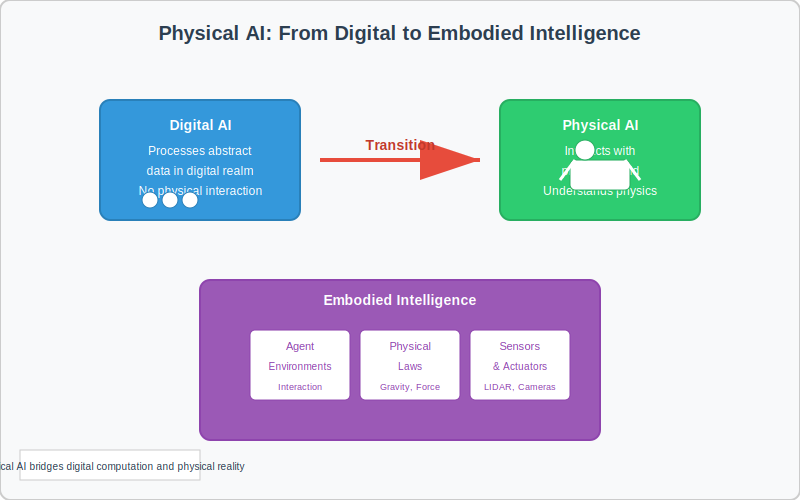

# Introduction to Physical AI

Welcome to the Physical AI & Humanoid Robotics textbook. This introduction covers the fundamental concepts of Physical AI and Embodied Intelligence.

## Overview

This module introduces you to the core principles of Physical AI, which represents the transition from Digital AI to robots that understand physical laws. You'll explore the humanoid robotics landscape and learn about essential sensor systems.

## Learning Objectives

- Understand the fundamental definition of Physical AI and Embodied Intelligence
- Learn about the transition from Digital AI to robots that understand physical laws
- Explore the humanoid robotics landscape
- Understand essential sensor systems (LIDAR, cameras, IMUs, force/torque sensors)

## Key Takeaways

1. **Physical AI bridges the gap between digital computation and physical reality** - Unlike traditional AI that processes abstract data, Physical AI systems must understand and interact with the physical laws that govern our universe.

2. **Embodied intelligence emerges from the interaction between an agent and its environment** - Intelligence is not just computation but emerges from the dynamic interaction between an agent and its physical surroundings.

3. **Understanding physical laws is crucial for robot navigation and manipulation** - Robots must comprehend concepts like gravity, friction, and collision dynamics to operate effectively in the real world.

4. **Sensor systems form the foundation for robot perception of the physical world** - LIDAR, cameras, IMUs, and force/torque sensors provide the sensory input that enables robots to perceive and interact with their environment.

5. **The integration of perception, cognition, and action creates truly intelligent robots** - True physical AI requires seamless integration between sensing the environment, processing that information, and executing appropriate physical actions.

## Self-Assessment Questions

After studying this introduction, consider these questions to reinforce your understanding:

1. How does Physical AI differ from traditional Digital AI?
2. What role does embodied intelligence play in Physical AI systems?
3. Why are sensor systems critical for Physical AI applications?
4. How does the transition from Digital AI to robots understanding physical laws impact robot design?

## Physical AI Concepts Visualization

Below is a visualization showing the transition from Digital AI to Physical AI with embodied intelligence:

## Foundations of Physical AI

Physical AI represents a paradigm shift from traditional digital AI systems to embodied intelligence that operates in the physical world. Unlike digital AI that processes abstract data, Physical AI systems must understand and interact with the physical laws that govern our universe.

### The Transition from Digital AI

Traditional AI systems operate primarily in the digital realm, processing text, images, audio, and other digital representations. Physical AI systems, on the other hand, must bridge the gap between digital computation and physical reality.

### Embodied Intelligence

Embodied intelligence refers to the concept that intelligence emerges from the interaction between an agent and its environment. This is in contrast to traditional AI systems that operate on abstract representations without direct physical embodiment.

## Hardware Requirements

This course covers technically demanding topics that may require specialized hardware:

- **RTX GPU**: Recommended for simulation and training tasks
- **Sufficient RAM**: 16GB+ recommended for complex simulations
- **Processor**: Multi-core processor for parallel computation

:::caution
**Expert Warning**: RTX GPU requirements become critical when working with complex simulations, real-time rendering, or training machine learning models. Plan your hardware investments accordingly.
:::

## Practical Examples

Here are some real-world applications of Physical AI concepts:

### Humanoid Robots
- **Boston Dynamics Atlas**: Demonstrates advanced physical AI with dynamic balance and complex movements
- **Honda ASIMO**: Pioneering humanoid robot with sophisticated locomotion and interaction capabilities
- **SoftBank Pepper**: Social robot integrating perception, cognition, and action

### Industrial Applications
- **Warehouse Automation**: Robots that understand spatial relationships and manipulate objects
- **Autonomous Vehicles**: Integration of perception, planning, and control in physical environments
- **Agricultural Robots**: Systems that interact with natural environments and biological systems

### Real-World Physical AI Analogies

:::tip
**Pro-Tip**: Understanding these analogies will help you grasp the fundamental differences between traditional digital AI and Physical AI. Think of these relationships as you progress through the textbook!
:::

To better understand the transition from Digital AI to Physical AI, consider these relatable analogies:

### Digital AI vs. Physical AI
- **Digital AI** is like a brilliant mathematician who can solve complex equations but has never touched a physical object. It processes abstract data without understanding the physical constraints of the real world.
- **Physical AI** is like an experienced craftsperson who understands how materials behave, how forces work, and how objects interact in the real world. It must navigate the laws of physics just like any physical entity.

### Embodied Intelligence Example
Consider how humans learn: We don't just process abstract information—we learn by interacting with our environment. When a child learns about gravity, they do so by dropping toys, climbing, falling, and observing how objects move. Physical AI systems learn similarly by interacting with the physical world, which is why embodiment is so crucial to intelligence.

:::note
**Key Insight**: The physical world provides rich learning opportunities that purely digital systems can't access. This is why embodied intelligence is so powerful.
:::

### Sensor Systems in Nature
Nature provides excellent examples of sensor systems that inspired robotic sensors:
- **LIDAR analogy**: Like bats using echolocation to navigate in darkness and detect obstacles
- **Camera systems**: Similar to how humans and animals process visual information to understand their environment
- **IMUs (Inertial Measurement Units)**: Like our inner ear's vestibular system that helps us maintain balance and understand our orientation in space
- **Force/Torque sensors**: Similar to how we can sense pressure and resistance when manipulating objects, allowing for delicate control

:::info
**Did you know?** Many of the sensors we use in robotics were inspired by biological systems. This bio-inspired approach has led to significant advances in robot perception and control.
:::

## Related Topics

- [Module 1: ROS 2 Fundamentals](../docs/module-1/ros2-fundamentals) - Learn about the robotic nervous system
- [Module 2: Robot Simulation](../docs/module-2/robot-simulation) - Explore physics simulation and digital twins

## Next Steps

Continue to Module 1: ROS 2 Fundamentals to dive deeper into the robotic nervous system.
