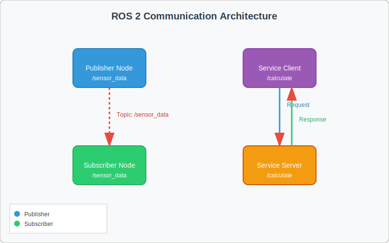

# ROS 2 Fundamentals

This document covers the core concepts of ROS 2 (Robot Operating System 2), the middleware for robot control.

## ROS 2 Architecture

ROS 2 is designed to be a flexible framework for developing robot applications. Think of it as the "operating system" for robots, providing a collection of libraries and tools that enable the development of complex, distributed robot systems.

:::tip
**Pro-Tip**: Understanding the ROS 2 architecture is fundamental to building effective robotic systems. Remember: Nodes are like apps, Topics are like messaging channels, Services are like API calls, and Actions are like long-running tasks with feedback.
:::

### Key Components

- **Nodes**: Basic compute units that perform computation - think of these as individual processes or applications
- **Topics**: Named buses over which nodes exchange messages using a publish-subscribe pattern
- **Services**: Synchronous request/response communication for immediate results
- **Actions**: Asynchronous goal-oriented communication for long-running tasks with feedback

## Detailed Coverage of Core Concepts

### Communication Model Diagram
Below is a visualization of the ROS 2 communication model showing how Nodes, Topics, and Services interact:



:::note
**Key Insight**: The publish-subscribe model (Topics) allows for loose coupling between nodes, making systems more robust and scalable than tightly coupled architectures.
:::

### Nodes
Nodes are the fundamental building blocks of ROS 2. Each node runs a specific task and communicates with other nodes through topics, services, or actions. A typical robot system consists of many nodes working together.

### Topics and Message Passing
Topics enable asynchronous communication between nodes using a publish-subscribe model. Publishers send messages to topics, and subscribers receive messages from topics they are subscribed to.

### Services
Services provide synchronous request-response communication. A client sends a request to a service, which processes the request and returns a response.

### Actions
Actions are used for long-running tasks that may take time to complete. They provide feedback during execution and can be canceled if needed.

:::tip
**Pro-Tip**: Use Actions for operations like navigation to a distant location, complex manipulation tasks, or calibration procedures where you need to track progress and potentially cancel the operation.
:::

## Connecting Python Agents to ROS Controllers

Using rclpy, the Python client library for ROS 2, you can create Python agents that interact with ROS controllers. Here's a basic example:

```python
import rclpy
from rclpy.node import Node
from std_msgs.msg import String  # Added missing import

class MinimalPublisher(Node):
    def __init__(self):
        super().__init__('minimal_publisher')
        self.publisher = self.create_publisher(String, 'topic', 10)
        timer_period = 0.5  # seconds
        self.timer = self.create_timer(timer_period, self.timer_callback)
        self.i = 0

    def timer_callback(self):
        msg = String()
        msg.data = 'Hello World: %d' % self.i
        self.publisher.publish(msg)
        self.get_logger().info('Publishing: "%s"' % msg.data)
        self.i += 1
```

## URDF (Unified Robot Description Format)

URDF is an XML format for representing a robot model. It defines the robot's physical and visual properties, including:

- Links: Rigid parts of the robot
- Joints: Connections between links
- Visual and collision properties
- Inertial properties

Here's a basic URDF example for a simple robot with a base and a wheel:

```xml
<?xml version="1.0"?>
<robot name="simple_robot">
  <!-- Base link -->
  <link name="base_link">
    <visual>
      <geometry>
        <box size="0.5 0.5 0.2"/>
      </geometry>
      <material name="blue">
        <color rgba="0 0 1 1"/>
      </material>
    </visual>
    <collision>
      <geometry>
        <box size="0.5 0.5 0.2"/>
      </geometry>
    </collision>
    <inertial>
      <mass value="1.0"/>
      <inertia ixx="0.1" ixy="0.0" ixz="0.0" iyy="0.1" iyz="0.0" izz="0.1"/>
    </inertial>
  </link>

  <!-- Wheel link -->
  <link name="wheel_link">
    <visual>
      <geometry>
        <cylinder radius="0.1" length="0.05"/>
      </geometry>
      <material name="black">
        <color rgba="0 0 0 1"/>
      </material>
    </visual>
  </link>

  <!-- Joint connecting base and wheel -->
  <joint name="wheel_joint" type="continuous">
    <parent link="base_link"/>
    <child link="wheel_link"/>
    <origin xyz="0 0 -0.15" rpy="0 0 0"/>
    <axis xyz="0 1 0"/>
  </joint>
</robot>
```

## Hardware Requirements

This module includes technically demanding topics that may require specialized hardware:

- **RTX GPU**: Recommended for simulation tasks
- **Sufficient RAM**: 16GB+ recommended for complex robotic simulations

:::caution
**Expert Warning**: RTX GPU requirements become critical when integrating ROS 2 with complex simulation environments. Consider hardware requirements early in your project planning.
:::

## Learning Objectives

- Understand the architecture of ROS 2 and its core concepts
- Learn how to implement Nodes, Topics, Services, and Actions
- Connect Python agents to ROS controllers using rclpy
- Understand URDF for humanoid robot representation

## Code Examples and Best Practices

### Best Practice 1: Proper Node Lifecycle Management

```python
import rclpy
from rclpy.node import Node

class BestPracticeNode(Node):
    def __init__(self):
        super().__init__('best_practice_node')
        # Initialize components
        self.get_logger().info('Node initialized')

    def destroy_node(self):
        # Cleanup resources before shutdown
        self.get_logger().info('Node cleanup complete')
        super().destroy_node()

def main(args=None):
    rclpy.init(args=args)
    node = BestPracticeNode()

    try:
        rclpy.spin(node)
    except KeyboardInterrupt:
        pass
    finally:
        node.destroy_node()
        rclpy.shutdown()

if __name__ == '__main__':
    main()
```

### Best Practice 2: Error Handling and Logging

```python
def process_sensor_data(self, msg):
    try:
        # Process the sensor data
        result = self.calculate_result(msg)
        self.publish_result(result)
    except ValueError as e:
        self.get_logger().error(f'Invalid sensor data: {e}')
    except Exception as e:
        self.get_logger().fatal(f'Unexpected error: {e}')
```

### Best Practice 3: Parameter Configuration

```python
def __init__(self):
    super().__init__('parameter_example_node')

    # Declare parameters with default values
    self.declare_parameter('publish_frequency', 10)
    self.declare_parameter('sensor_topic', '/sensors/data')

    # Access parameters
    self.frequency = self.get_parameter('publish_frequency').value
    self.topic_name = self.get_parameter('sensor_topic').value
```

## Hands-on Tutorials

### Tutorial 1: Creating Your First ROS 2 Node

1. Create a new Python file (e.g., `my_first_node.py`)
2. Import the necessary ROS 2 libraries
3. Create a class that inherits from `Node`
4. Initialize the node in the constructor
5. Run the node using the ROS 2 execution model

### Tutorial 2: Publisher-Subscriber Communication

1. Create a publisher node that sends messages to a topic
2. Create a subscriber node that listens to the same topic
3. Test the communication between nodes
4. Observe the asynchronous message passing

### Tutorial 3: Service Client-Server Interaction

1. Implement a service server that responds to requests
2. Create a client that sends requests to the service
3. Test the synchronous request-response pattern
4. Observe how services differ from topics

## Analogies and Real-World Comparisons

Understanding ROS 2 concepts can be easier with familiar analogies:

### Nodes and Topics Analogy
Think of Nodes as people in a company and Topics as shared bulletin boards. Each person (Node) posts updates on specific boards (Topics) and checks other boards for information they need. People can post and read asynchronously without needing to coordinate schedules.

### Services Analogy
Services are like customer service desks where you go with a specific request and get a direct response. Just as you'd visit a help desk to get a specific question answered, a ROS client makes a request to a service and receives a direct response.

### Actions Analogy
Actions are like hiring a contractor for a complex job. You give them a goal, they work on it for a while, periodically updating you on progress, and eventually report completion. This is perfect for long-running tasks like robot navigation to a distant location.

## Key Takeaways

1. **ROS 2 provides a flexible framework for distributed robot applications** - Its architecture enables multiple computational units to work together in a coordinated manner, forming the "nervous system" of the robot.

2. **The publish-subscribe model enables asynchronous communication** - Nodes can share information without needing to coordinate timing, making the system more robust and scalable.

3. **Services offer synchronous request-response communication** - Ideal for operations that require a guaranteed response before proceeding, such as configuration changes or state queries.

4. **Actions are ideal for long-running tasks with feedback** - Perfect for operations like navigation or manipulation that take time to complete and may need to be monitored or canceled.

5. **rclpy allows Python integration with ROS 2 systems** - Python agents can connect to ROS controllers, enabling rapid prototyping and development using familiar programming paradigms.

## Self-Assessment Questions

After studying this module, consider these questions to reinforce your understanding:

1. What are the key differences between Topics, Services, and Actions?
2. When would you use a Service versus a Topic for communication?
3. How does rclpy facilitate the connection between Python agents and ROS controllers?
4. What are the benefits of the publish-subscribe model for robot applications?

## Related Topics

- [Module 1 Overview](./index) - Introduction to ROS 2 fundamentals
- [Module 2: Robot Simulation](../docs/module-2/robot-simulation) - Simulation environments for ROS 2
- [Introduction to Physical AI](../docs/intro) - Foundation concepts

## Next Steps

Continue to Module 2: Robot Simulation to learn about physics simulation and environment building.