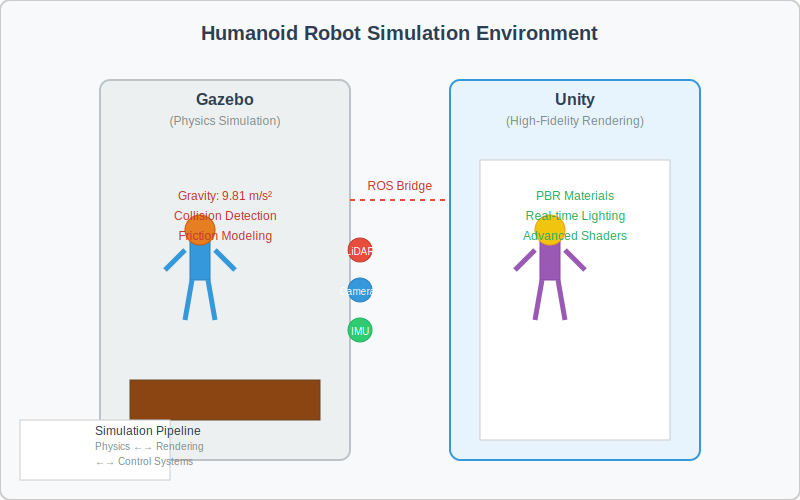

# Robot Simulation

This document covers the fundamentals of robot simulation using Gazebo and Unity for creating digital twins.

## Simulation Environment Visualization

Below is a visualization showing a humanoid robot in both Gazebo (physics simulation) and Unity (high-fidelity rendering) environments:

:::info
**Key Concept**: In Gazebo, the world-coordinate system typically follows the right-hand rule with X-forward, Y-left, and Z-up. Understanding this coordinate system is crucial for accurate robot localization and navigation in simulation.
:::

## Gazebo Simulation Environment

Gazebo is a powerful 3D simulation environment that provides accurate physics simulation, realistic rendering, and convenient programmatic interfaces.

### Key Features

- Physics simulation with gravity and collisions
- Sensor simulation (LiDAR, cameras, IMUs)
- Plugin system for custom functionality
- Integration with ROS/ROS 2

### Gazebo Setup and Configuration

To set up Gazebo for your robotics projects:

1. Install Gazebo with ROS 2 integration
2. Configure physics parameters (gravity, friction, etc.)
3. Set up lighting and rendering settings
4. Create or import robot models (URDF/SDF format)

## Physics Simulation Concepts

Physics simulation is crucial for realistic robot behavior in virtual environments. Without accurate physics, your robot may work perfectly in simulation but fail when deployed in the real world.

:::tip
**Pro-Tip**: Always validate your simulation results with real-world tests. While simulation is incredibly valuable, small differences in physics parameters can lead to significant behavioral differences in actual robots.
:::

### Gravity and Environmental Forces
- Standard Earth gravity: 9.81 m/s²
- Custom gravity settings for different environments (e.g., moon, Mars)
- Wind forces and other environmental effects

:::caution
**Expert Warning**: VSLAM (Visual Simultaneous Localization and Mapping) systems can be particularly sensitive to physics simulation accuracy. Small variations in lighting, surface textures, or object positions can significantly impact algorithm performance.
:::

### Collision Detection
- Collision meshes for accurate physics
- Contact sensors and force feedback
- Collision avoidance algorithms

## Sensor Simulation

Simulating sensors accurately is essential for developing and testing robot perception systems:

### LiDAR Simulation
- 2D and 3D LiDAR models
- Ray tracing for accurate distance measurements
- Noise modeling to simulate real-world conditions

### Depth Camera Simulation
- RGB-D camera models
- Point cloud generation
- Stereo vision simulation

### IMU Simulation
- Accelerometer and gyroscope modeling
- Drift and noise characteristics
- Integration with robot dynamics

## Unity for High-Fidelity Rendering

Unity provides advanced rendering capabilities for creating photorealistic simulation environments:

### Key Features
- Physically-based rendering (PBR)
- Real-time lighting and shadows
- Advanced materials and textures
- VR/AR support for immersive simulation

### Integration with Robotics
- Unity Robotics Hub for ROS communication
- Perception package for synthetic data generation
- ML-Agents for robot training and testing

## Practical Examples

### Example 1: Mobile Robot Navigation
- Simulate a differential drive robot in Gazebo
- Implement SLAM algorithms
- Test path planning in various environments

### Example 2: Manipulator Control
- Simulate a robotic arm with accurate physics
- Test inverse kinematics solutions
- Implement grasping and manipulation tasks

### Example 3: Humanoid Robot Simulation
- Create a complex humanoid model
- Implement balance and locomotion controllers
- Test whole-body control strategies

## Learning Objectives

- Set up Gazebo simulation environment for robotics projects
- Understand physics simulation concepts including gravity and collisions
- Implement sensor simulation for LiDAR, cameras, and IMUs
- Use Unity for high-fidelity rendering and visualization
- Create digital twins of robotic systems

## Creating Digital Twins: Step-by-Step Tutorial

### Step 1: Model Creation
1. Create or obtain a 3D model of your robot
2. Define physical properties (mass, inertia, friction)
3. Set up joint constraints and limits
4. Add visual and collision meshes

### Step 2: Physics Configuration
1. Configure gravity and environmental forces
2. Set up collision detection parameters
3. Define contact properties and friction coefficients
4. Calibrate sensor models with realistic noise characteristics

### Step 3: Integration with Control Systems
1. Connect simulation to ROS/ROS 2 nodes
2. Implement sensor data publishing
3. Set up actuator control interfaces
4. Validate sensor-control loop timing

### Step 4: Validation and Testing
1. Compare simulation results with real-world data
2. Tune parameters for accuracy
3. Test edge cases safely in simulation
4. Iterate until simulation adequately represents reality

## Key Takeaways

1. **Simulation enables safe and cost-effective robot development** - Complex robot behaviors can be tested in virtual environments without risk of physical damage to robots or surroundings.

2. **Accurate physics simulation is crucial for realistic behavior** - Proper modeling of gravity, collisions, and environmental forces ensures that behaviors tested in simulation transfer effectively to real-world applications.

3. **Sensor simulation must include realistic noise and limitations** - For effective development, simulated sensors should reflect real-world imperfections and constraints to ensure robust system design.

4. **Unity provides high-fidelity rendering for advanced visualization** - For applications requiring photorealistic representation, Unity offers advanced rendering capabilities that enhance development and presentation.

5. **Digital twins bridge the gap between simulation and reality** - Virtual replicas of physical robots and environments enable comprehensive testing and validation before real-world deployment.

## Self-Assessment Questions

After studying this module, consider these questions to reinforce your understanding:

1. What are the key advantages of simulation in robot development?
2. Why is it important to include realistic noise in sensor simulation?
3. How do digital twins benefit the development lifecycle?
4. What are the differences between Gazebo and Unity for simulation purposes?

## Hardware Requirements

This module includes technically demanding topics that may require specialized hardware:

- **RTX GPU**: Required for high-fidelity rendering and complex simulations
- **Sufficient RAM**: 16GB+ recommended for complex robotic simulations

:::caution
**Expert Warning**: Hardware bottlenecks can significantly impact simulation fidelity. RTX GPUs with ray tracing capabilities provide substantial benefits for realistic lighting and sensor simulation.
:::

## Related Topics

- [Module 2 Overview](/docs/module-2) - Introduction to robot simulation
- [Module 1: ROS 2 Fundamentals](/docs/module-1/ros2-fundamentals) - Integration with ROS 2 systems
- [Introduction to Physical AI](/docs/intro) - Foundation concepts of embodied intelligence

## Next Steps

Continue to Module 3: The AI-Robot Brain to learn about robot decision making and control.